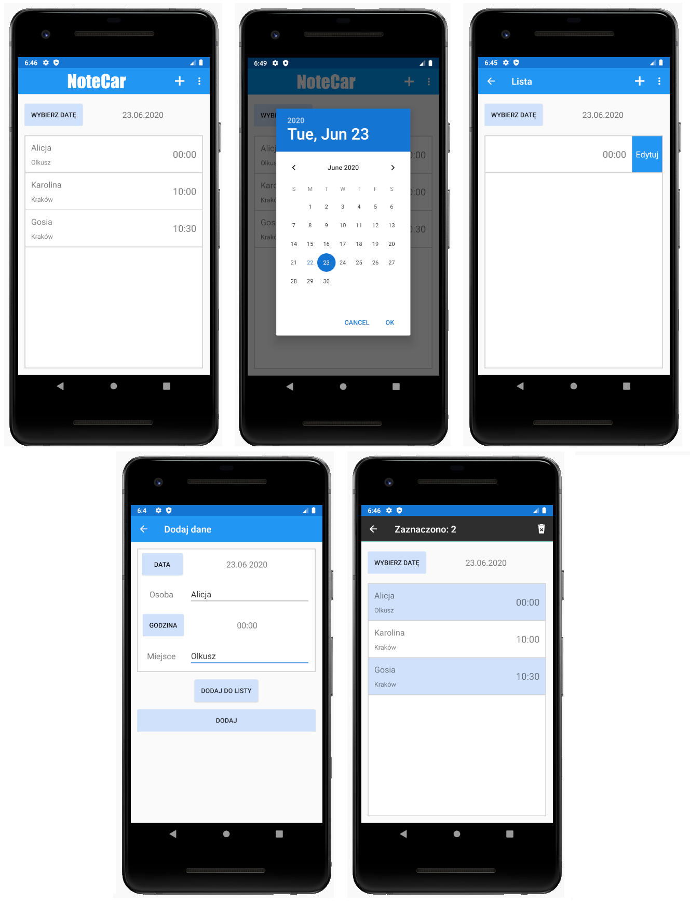

# NoteCar
NoteCar is an app where you can plan and manage free space in a passenger car. It enables you to store data about the people you go to work with, place of picking up, time and date.

## Table of contents
* [Technology](#technology)
* [Installation](#installation)
* [Features](#features)
* [Screenshots](#screenshots)

## Technology
Project is created with:
* Android Studio 4.0

## Installation

1. Clone the repository to "AdroidStudioProjects" folder

## Features
List of features:
* Two lists - list with data and list with templates
* Adding, editing and deleting records from list with data
* Adding records to list with templates
* Deleting and editing data from list with templates
* Adding records from list with templates to list with data

## Screenshots

    

